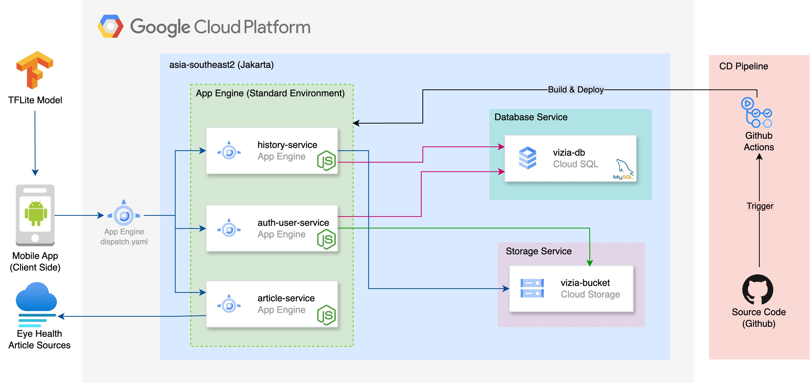

<h1 align="center" style="font-weight: bold;">Vizia API 💻</h1>

<p align="center">
 <a href="#tech">Technologies</a> • 
 <a href="#cloud-architecture">System Design</a> • 
 <a href="#folder-structure">Folder Strcuture</a> • 
 <a href="#started">Getting Started</a> • 
 <a href="#routes">API Endpoints</a> •
 <a href="#colab">Collaborators</a> •
 <a href="#contribute">Contribute</a>
</p>

<p align="center">
    <b>Documentation of Backend API Application for Vizia Project</b>
</p>

<h2 id="technologies">💻 Technologies</h2>

- Javascript
- HapiJS
- MySQL
- Postman
- Swagger
- App Engine
- Cloud Storage
- Cloud SQL

<h2 id="cloud-architecture">☁️ System Design</h2>


<h2 id="folder-structure">📁 Folder Structure</h2>

    .
    ├── .github                    # CD pipeline configuration, triggered by GitHub Actions
    ├── article-service            # Scrap and serves eye health articles from various sources
    ├── database-migrator          # Database migration to define schema in cloud DBMS
    ├── default-service            # OpenAPI Swagger documentation from whole of services
    ├── history-service            # Handles the storage and retrieval of eye prediction data
    ├── user-auth-service          # Manages user authentication and authorization
    ├── setup.sh                   # Entrypoint to setup nodejs dependency foreach services
    ├── vizia-openapi.yaml         # API definition for API Gateway
    └── README.md

<h2 id="started">🚀 Getting started</h2>

Here is describe how to run this project locally

<h3>Prerequisites</h3>

Here is list all prerequisites necessary for running this project. For example:

- [NodeJS](https://nodejs.org/)
- [Git](https://git-scm.com/downloads)
- [Google Cloud Platform](https://console.cloud.google.com)

<h3>Cloning</h3>

How to clone this project

```bash
git clone https://github.com/Vizia-Project/vizia-backend-service
```

<h3>Config .env variables</h2>

Use the `.env.example` as reference to create your configuration file `.env` with your GCP and Database Credentials

```yaml
NODE_ENV=development
PORT=3002

DB_HOST=
DB_PORT=3306
DB_USER=
DB_PASSWORD=
DB_NAME=

JWT_SECRET=

GOOGLE_CLOUD_PROJECT_ID=
GOOGLE_CLOUD_BUCKET_NAME=
```

> Do the same thing on the app.yaml file of app.example.yaml

<h3>Put GCP service account</h3>

1. Log in to the Google Cloud Platform (GCP) console
2. Create a service account. Go to the IAM & Admin section in the navigation menu. Select Service Accounts. Click Create Service Account. Enter a Name and ID for your service account. Optionally, add a Description. Click Create and continue.
3. Create a key On the service account page, click the Keys tab. Click Add Key. Select Create new key. Choose JSON as the key type. Click Create. A JSON file containing the service account key will be downloaded to your computer.
4. Put service json in each service.

<h3>Starting</h3>

How to start this project

```bash
cd vizia-backend-service
./setup.sh # For linux or macos
```
> Use setup.sh without './' for Windows

<h2 id="routes">📍 API Endpoints</h2>

Here is list the main routes of this API, and what are their expected request bodies and responses.
​
| route               | description                                          
|----------------------|-----------------------------------------------------
| <kbd>POST /login</kbd>     | Validate existing account by email and password [request details](https://vizia-web-1037967286998.asia-southeast2.run.app/api-docs/#/Authentication/post_login)
| <kbd>POST /register</kbd>     | Add a new user account and validate each of input [request details](https://vizia-web-1037967286998.asia-southeast2.run.app/api-docs/#/Authentication/post_register)
| <kbd>GET /user/{id}</kbd>     | Get account information and settings of user [request details](https://vizia-web-1037967286998.asia-southeast2.run.app/api-docs/#/User/get_user__id_)
| <kbd>PUT /user/{id}</kbd>     | Update account information and settings of user [request details](https://vizia-web-1037967286998.asia-southeast2.run.app/api-docs/#/User/put_user__id_)
| <kbd>GET /articles</kbd>     | Fetch all articles from all resources [request details](https://vizia-web-1037967286998.asia-southeast2.run.app/api-docs/#/Article/get_articles)
| <kbd>GET /articles/detail</kbd>     | Get detail from an article [request details](https://vizia-web-1037967286998.asia-southeast2.run.app/api-docs/#/Article/get_articles_detail)
| <kbd>GET /histories</kbd>     | Fetch all histories of predicts result by user account [request details](https://vizia-web-1037967286998.asia-southeast2.run.app/api-docs/#/History/get_histories)
| <kbd>POST /histories</kbd>     | Save predicts result by user account [request details](https://vizia-web-1037967286998.asia-southeast2.run.app/api-docs/#/History/post_histories)
| <kbd>GET /histories/{id}</kbd>     | Fetch history detail of predicts result by history id [request details](https://vizia-web-1037967286998.asia-southeast2.run.app/api-docs/#/History/get_histories__id_)

<h3>POST /login</h3>

**REQUEST**
```json
{
  "email": "her-email@gmail.com",
  "password": "4444444"
}
```

**RESPONSE**
```json
{
  "status": "success",
  "message": "Login and get user are success",
  "data": {
    "id": 115,
    "name": "Teme Wakaihasite",
    "token": "eyJhbGciOiJIUzI1NiIsInR5cCI6IkpXVCJ9.eyJpZCI6OCwiaWF0IjoxNzMzMTQ5MDU0fQ"
  }
}
```

<h3>POST /register</h3>

**REQUEST**
```json
{
  "name": "Teme Wakaihasite",
  "email": "her-email@gmail.com",
  "password": "4444444",
  "password_confirmation": "4444444"
}
```

**RESPONSE**
```json
{
  "status": "success",
  "message": "New account creation is success",
  "data": {
    "id": 115,
    "name": "Teme Wakaihasite",
    "email": "temewaki@gmail.com"
  }
}
```

For more API endpoint details, please visit <a href="https://vizia-web-1037967286998.asia-southeast2.run.app/api-docs">Vizia OpenAPI Docs</a>

<h2 id="colab">🤝 Collaborators</h2>

Special thank you for all people that contributed for this project.

<table>
  <tr>
    <td align="center">
      <a href="#">
        <br>
        <sub>
          <b>Abu Toyib Al Aziz</b>
        </sub>
      </a>
    </td>
    <td align="center">
      <a href="#">
        <br>
        <sub>
          <b>Anna Stefanie Ruitan</b>
        </sub>
      </a>
    </td>
  </tr>
</table>

<h2 id="contribute">📫 Contribute</h2>

Here you will explain how other developers can contribute to your project. For example, explaining how can create their branches, which patterns to follow and how to open an pull request

1. `git clone https://github.com/Fernanda-Kipper/text-editor.git`
2. `git checkout -b feature/NAME`
3. Follow commit patterns
4. Open a Pull Request explaining the problem solved or feature made, if exists, append screenshot of visual modifications and wait for the review!

<h3>Documentations that might help</h3>

[📝 How to create a Pull Request](https://www.atlassian.com/br/git/tutorials/making-a-pull-request)

[💾 Commit pattern](https://gist.github.com/joshbuchea/6f47e86d2510bce28f8e7f42ae84c716)